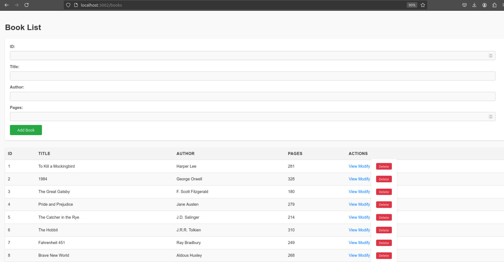
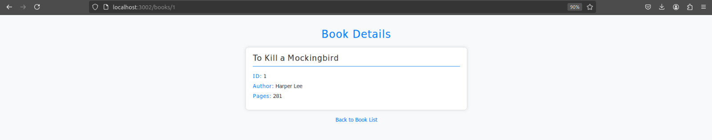
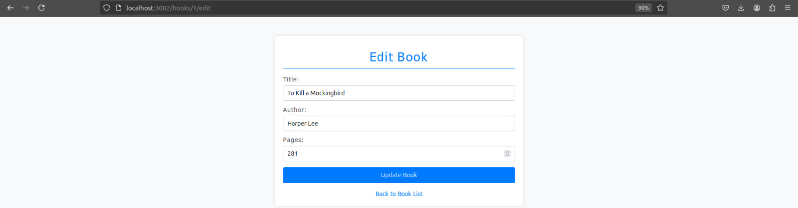
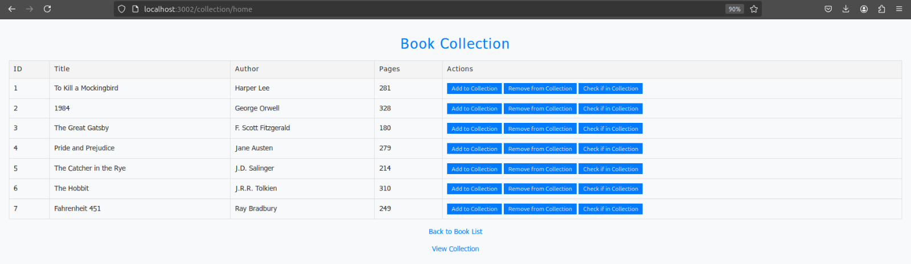
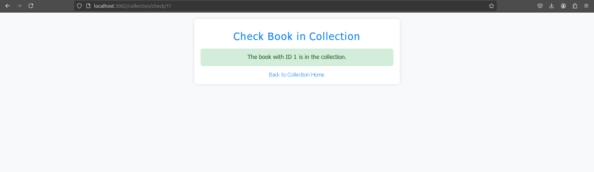
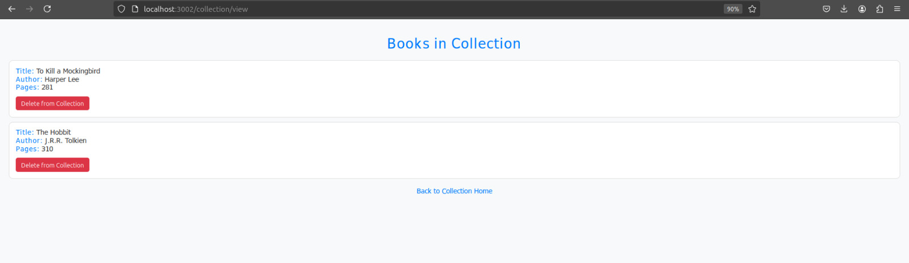

# BookManager-Web-API

This project is a full-stack web app for managing a book collection, featuring basic CRUD operations. Built with Node.js and Express for the backend and MongoDB for data storage, it uses EJS for templating and CSS for styling.

## Features

- Create, Read, Update, and Delete (CRUD) operations for books.
- Front-end rendered with EJS templates.
- Styled with CSS.
- RESTful API endpoints for book management.

## Technologies Used

- **Node.js**: JavaScript runtime.
- **Express**: Backend framework.
- **MongoDB**: NoSQL database.
- **EJS**: Embedded JavaScript templating.
- **CSS**: Styling.

## Installation

   ```bash
   git clone https://github.com/ChopinF69/BookManager-Web-API.git
   cd BookManager-Web-API
   npm install
   ```

## How to run 
  ```
  node app.js
  ```
### First Page - CRUD for simple REPO
All the CRUD operations are implemented ! 
- 
- 
- 
### Second Page - CRUD for the collection ( like adding to a wishlist ).
- 
- 
- 
